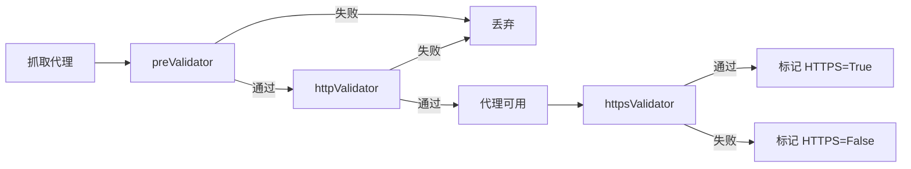

# 扩展校验器

## 内置校验

项目中使用的代理校验方法全部定义在 `helper/validator.py` 中，通过 `ProxyValidator` 类中提供的装饰器来区分。校验方法返回 `True` 表示校验通过，返回 `False` 表示校验不通过。

代理校验方法分为三类：

| 类型 | 装饰器 | 说明 |
|------|--------|------|
| `preValidator` | `@ProxyValidator.addPreValidator` | 预校验，在代理抓取后验证前调用 |
| `httpValidator` | `@ProxyValidator.addHttpValidator` | 代理可用性校验，通过则认为代理可用 |
| `httpsValidator` | `@ProxyValidator.addHttpsValidator` | 校验代理是否支持 HTTPS |

每种校验可以定义多个方法，只有**所有**方法都返回 `True` 的情况下才视为该校验通过。

### 校验执行顺序



- `preValidator` 校验通过的代理才会进入可用性校验
- `httpValidator` 校验通过后认为代理可用，更新入代理池
- `httpsValidator` 校验通过后视为代理支持 HTTPS，更新代理的 `https` 属性为 `True`

## 扩展校验

在 `helper/validator.py` 中已有自定义校验的示例，自定义函数需返回 `True` 或者 `False`，使用 `ProxyValidator` 中提供的装饰器来区分校验类型。

### 示例 1：自定义代理可用性校验

```python
@ProxyValidator.addHttpValidator
def customValidatorExample01(proxy):
    """自定义代理可用性校验函数"""
    proxies = {"http": "http://{proxy}".format(proxy=proxy)}
    try:
        r = requests.get("http://www.baidu.com/", headers=HEADER, proxies=proxies, timeout=5)
        return True if r.status_code == 200 and len(r.content) > 200 else False
    except Exception as e:
        return False
```

### 示例 2：自定义 HTTPS 校验

```python
@ProxyValidator.addHttpsValidator
def customValidatorExample02(proxy):
    """自定义代理是否支持 HTTPS 校验函数"""
    proxies = {"https": "https://{proxy}".format(proxy=proxy)}
    try:
        r = requests.get("https://www.baidu.com/", headers=HEADER, proxies=proxies, timeout=5, verify=False)
        return True if r.status_code == 200 and len(r.content) > 200 else False
    except Exception as e:
        return False
```

!!! note
    在运行代理可用性校验时，所有被 `ProxyValidator.addHttpValidator` 装饰的函数会依次按定义顺序执行，只有当所有函数都返回 `True` 时才会判断代理可用。`HttpsValidator` 运行机制也是如此。